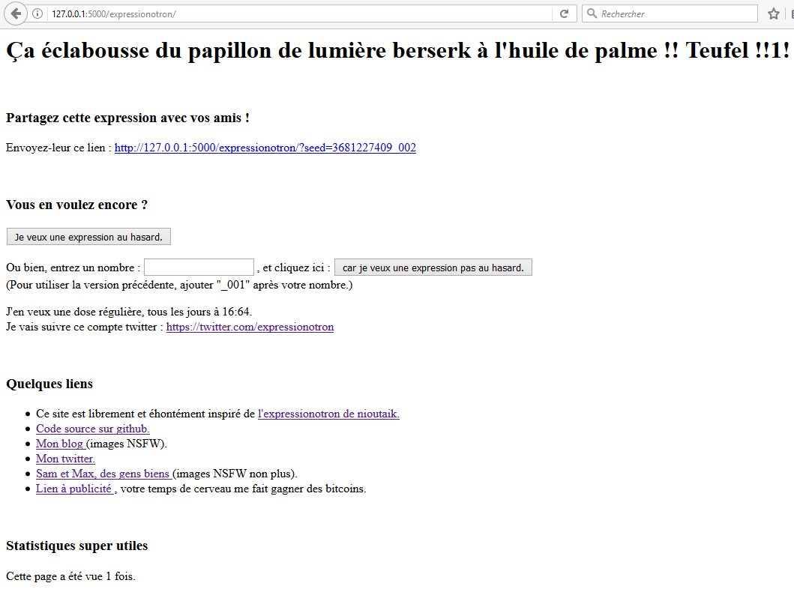

# Exécution du site expressionotron en local

Le fichier python principal `repo_git/expressionotron/server/mysite/flask_app.py` essaie d'importer deux Blueprints : "urluth" et "expressionotron". S'il en manque un, ou les deux, le site démarrera quand même, car les échecs d'imports sont non bloquants.

Dans le cas de ce repository, seul "expressionotron" est présent.

## Récupération du code

Clonez ou copiez ce repository sur votre disque. Dans la suite de cette documentation, on suppose qu'il est placé dans `C:\expressionotron`

## Installation des dépendances

Installez le python 3.4 ou une version 3.x supérieure : [https://www.python.org/](https://www.python.org/). Je vous laisse vous débrouiller pour les détails.

La lib Flask est nécessaire. Normalement, son installation s'effectue avec une simple commande `pip install Flask`. Mais il semblerait que des fois, ce soit un peu plus compliqué (en particulier sous Windows XP). Voir : [install_pip_and_flask.md](install_pip_and_flask.md)

## Vérification des versions installées

Démarrez une fenêtre de commande. (Windows, Linux, Mac ou autre, selon votre système).

    C:\>python
    Python 3.4.4 (v3.4.4:737efcadf5a6, Dec 20 2015, 20:20:57) [MSC v.1600 64 bit (AM
    D64)] on win32
    Type "help", "copyright", "credits" or "license" for more information.
    >>> import flask
    >>> flask.__version__
    '0.10.1'
    >>> exit()

## Lancement du site en local

Démarrez une fenêtre de commande et allez dans le répertoire contenant le repository, `C:\expressionotron` dans notre exemple.

    C:\expressionotron>cd server
    C:\expressionotron\server>cd mysite
    C:\expressionotron\server\mysite>python flask_app.py
     * Running on http://127.0.0.1:5000/ (Press CTRL+C to quit)

Démarrez un navigateur web quelconque et allez à l'adresse : `http://127.0.0.1:5000/`

Vous devriez voir une page web toute simple, avec le texte suivant.

> Il n'y a pas grand-chose ici. Vous pouvez juste :
> - cliquez ici pour aller à l'expressionotron

Cliquez sur le lien. Vous devriez voir la page web suivante :

Le site ne fonctionne pas complètement, car le compteur de visite reste bloqué à 1 (le fichier ne peut pas être créé car le chemin n'existe pas).

Dans la fenêtre de commande, les logs de flask montrent que tout va bien et que c'est cool.

     * Running on http://127.0.0.1:5000/ (Press CTRL+C to quit)
    127.0.0.1 - - [06/Feb/2017 19:31:49] "GET / HTTP/1.1" 200 -
    127.0.0.1 - - [06/Feb/2017 19:31:50] "GET /expressionotron/ HTTP/1.1" 200 -

Pour arrêtez le serveur flask : retournez à la fenêtre de commande et utilisez le raccourci Ctrl+C.

## Lancement du twitter bot

Il est nécessaire d'avoir le module python "twitter". Ce module est pré-installé sur la plate-forme d'hébergement pythonanywhere.
Le twitter bot a été testé directement sur pythonanywhere, mais jamais en local. À priori, il suffirait juste de "pip install twitter" et d'exécuter le script `repo_git/expressionotron/server/mysite/twit_cron.py`.

## Passage des tests

Les tests ont été créés à l'aide du module pytest. Pour plus de détails sur l'installation, voir la doc précédemment mentionnée : [install_pip_and_flask.md](install_pip_and_flask.md).

Le passage des tests se fait de la manière standard prévue par pytest :

    C:\expressionotron>cd server
    C:\expressionotron\server>cd mysite
    C:\expressionotron\server\mysite>python -m py.test
    ============================= test session starts =============================
    platform win32 -- Python 3.4.4, pytest-2.8.7, py-1.4.31, pluggy-0.3.1
    rootdir: C:\Recher\projets\git\expressionotron\server\mysite, inifile:
    collected 14 items

    test_dataphrase_v2.py .
    test_expre_v1.py ..
    test_expre_v2.py ......
    test_seeder_v2.py .....

    ========================== 14 passed in 5.55 seconds ==========================

Le détail des tests n'est pas décrit dans cette documentation. C'est lourdingue d'écrire des tests mais je l'ai fait quand même, c'est lourdingue d'écrire la documentation mais je l'ai fait quand même, je peux donc me permettre de ne pas écrire la documentation à propos des tests.

