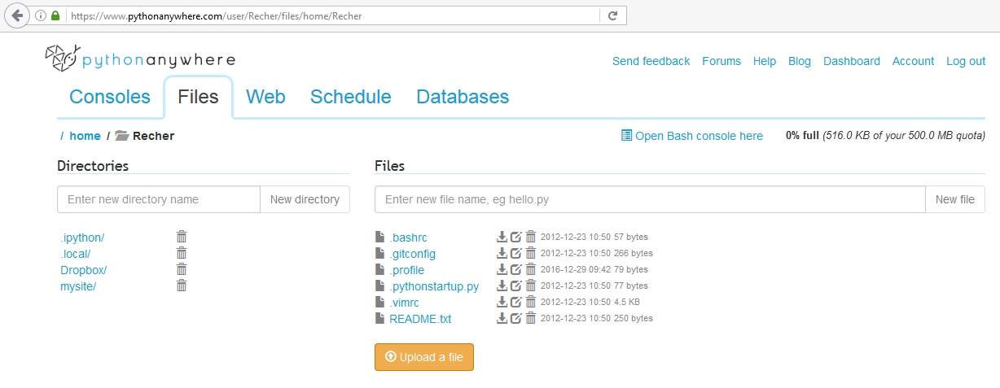
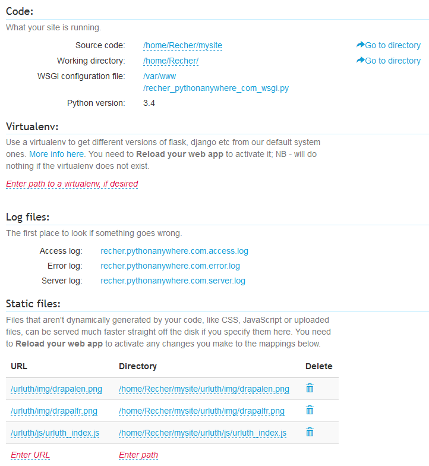
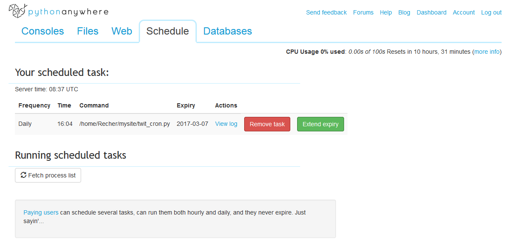

# Mise en production du site dans pythonanywhere.com

Il n'y a rien d'automatisé. La mise à jour des fichiers et de la configuration doit être faite manuellement.

## Création du compte

Je ne sais plus exactement ce que j'ai fais, mais c'est assez simple.

## Arborescence des fichiers

Pour afficher l'arborescence dans pythonanywhere, cliquer sur l'onglet "Files".

L'arborescence est la suivante :

 - `/home/`
    * `Recher/`
        + `.ipython`/ : non versionné. Créé par pythonanywhere. Non modifié.
        + `.local/`
            - `bin/` : non versionné. Créé par pythonanywhere. Non modifié.
        + `Dropbox/` : répertoire vide
        + `mysite/`
            - `__pycache__/` : non versionné. Géré automatiquement par le python.
            - `expressionotron/` : contient l'application. Correspond au répertoire [repo_git/server/mysite/expressionotron](../server/mysite/expressionotron)
            - `urluth/` : non versionné dans ce repo. Correspond à l'autre application. Facultatif.
            - `flask_app.py` : fichier principal du site. Correspond à [repo_git/server/mysite/flask_app.py](../server/mysite/flask_app.py)
            - `secret_key.py` : fichier contenant la clé secrète du site. Non versionné (le fichier dans ce repository contient une clé par défaut).
            - `twit_cron.py` : script exécutant le twitter bot. Il est lancé par la tâche planifiée de pythonanywhere.
        + `.bashrc` : créé par pythonanywhere. Correspond à [repo_git/server/.bashrc.txt](../server/.bashrc.txt)
        + `.gitconfig` : créé par pythonanywhere. Correspond à [repo_git/server/.gitconfig.txt](../server/.gitconfig.txt)
        + `.profile` : créé par pythonanywhere. Correspond à [repo_git/server/.profile.txt](../server/.profile.txt)
        + `.pythonstartup.py` : créé par pythonanywhere. Correspond à [repo_git/server/.pythonstartup.py](../server/.pythonstartup.py)
        + `.vimrc` : créé par pythonanywhere. Correspond à [repo_git/server/.vimrc.txt](../server/.vimrc.txt)
        + `README.txt` : créé par pythonanywhere. Correspond à [repo_git/server/README.txt](../server/README.txt)

Les fichiers à la racine du site : `.bashrc`, `.gitconfig`, `.profile`, `.vimrc` sont enregistré avec l'extension `.txt` dans le repository, alors qu'ils n'en ont pas dans pythonanywhere. Je travaille sous Windows et on ne peut pas créer de fichier commençant par un point et n'ayant pas d'extension. Désolé.

## Configuration du site

La config se fait dans l'onglet "Web".

App : Recher.pythonanywhere.com

### Code

 - Source code : `/home/Recher/mysite`
 - Working directory : `/home/Recher/`
 - WSGI configuration file : `/var/www/recher_pythonanywhere_com_wsgi.py`
 - Python version : 3.4

La version de python 3.4 est celle par défaut sur pythonanywhere. Pas besoin de configurer autrement.

### Virtualenv

Pas de virtualenv

### Log files

 - Access log : `recher.pythonanywhere.com.access.log`
 - Error log : `recher.pythonanywhere.com.error.log`
 - Server log : `recher.pythonanywhere.com.server.log`

### Static files

L'expressionotron n'utilise pas de fichiers statiques.

Les fichiers visibles dans le screenshot sont utilisés par l'application urluth. Ils ne servent à rien pour l'expressionotron.

### Password protection

Aucune

## Tâches planifiées

La tâche planifiée est configurée dans l'onglet "Schedule", c'est ce qui permet de déclencher le twitter bot.

Frequency | Time  | Command                          | Expiry
----------|-------|----------------------------------|----------
Daily     | 16:04 | /home/Recher/mysite/twit_cron.py | 2017-03-07

Le twit doit être envoyé tous les jours à 16:64, c'est à dire 17:04, heure française. L'heure à indiquer dans la configuration de pythonanywhere est en UTC, donc il faut décaler de une heure : 16:04.

Je ne sais pas si le décalage "heure d'été - heure d'hiver" est géré. Il est possible que pendant une moitié de l'année (je ne sais pas laquelle) ce soit décalé d'une heure.

Le compte pris sur pythonanywhere est gratuit, la date d'expiration de la tâche doit donc être régulièrement reportée. Cette action doit être effectuée manuellement, il n'y a pas d'autre solutions (à part celle de payer).

Le lien "View log" permet de consulter les logs de l'exécution journalière du twitter bot.

[Exemple de log.](log_twit_bot.txt)

## Bases de données

Configurées dans l'onglet "Databases".

Mais il n'y a aucune base de données.

